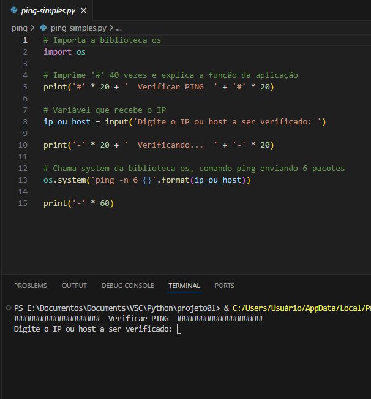
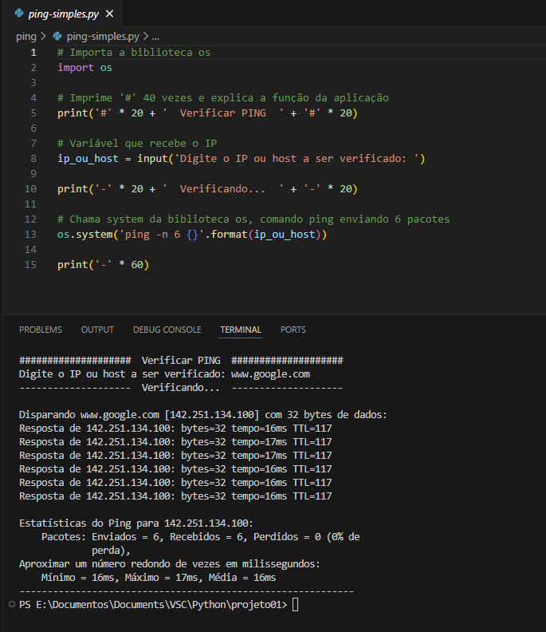
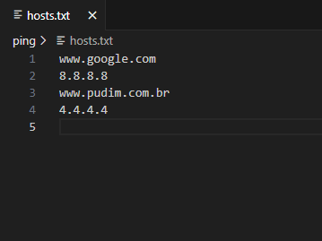
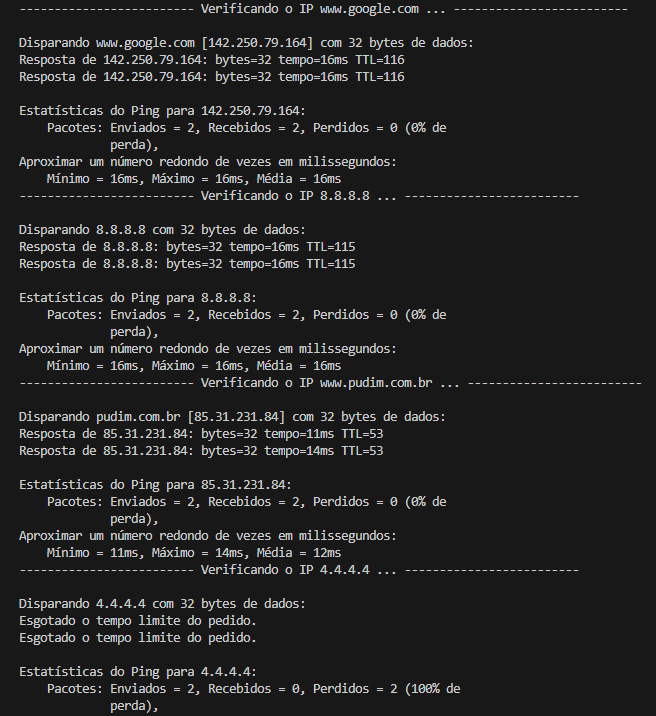

# Ping Test

1º - Aplicação "ping-simples.py"
- solicita um IP para o usuário:

- Mostra o resultado do teste:

2º - Aplicação "ping-multiplo.py"
- recebe os endereços IP de um arquivo txt

- Mostra o resultado dos testes, com um intervalo de 5 segundos:

